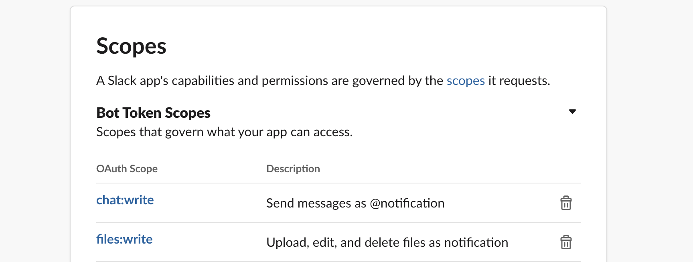

## eas-slack-build-notify
A serverless lambda to notify the result of EAS build.  
Using [Serverless Framework](https://www.serverless.com/).

## Installation

1. Slack Bot Setup
    1. [Create slack app](https://slack.dev/bolt-js/tutorial/getting-started)  
    needs a [`chat:write`](https://api.slack.com/scopes/chat:write) and [`files:write`](files:write)  
       
    1. Invite app to channel
    1. Rewrite `REPLACE_ME` in the [serverless.yml](./serverless.yml) file
    1. Deploy to AWS  
        ```sh
        $ npm i
        $ sls deploy
        ```
1. EAS Build Webhooks setup
    1. Set up a webhook with [`eas webhook:create`](https://docs.expo.dev/build-reference/build-webhook/).   
        The URL of the webhook is the URL of the endpoint returned by `sls deploy`.  
        e.g. `https://XXXXXXXX.execute-api.YOUR-REGION.amazonaws.com/dev/webhook`
